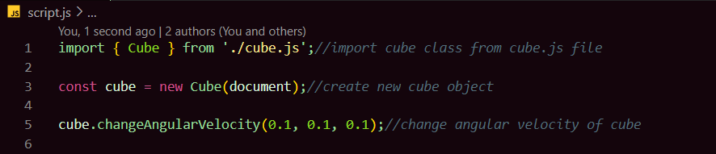

spin(cube).js is a library that creates a spining cube with angular velocity control that appends to the Html element passed as argument when using new Cube(element); like so

Make sure to include type="module" when linking the script.js containing the Cube instance like so
  
There is an example branch that has a plain example of creating a angular velocity control cube appended to the document.
There is also a github pages example that features 3 sliders controling the 3 degrees(axis) of freedom, for which the link is in the description :)!
